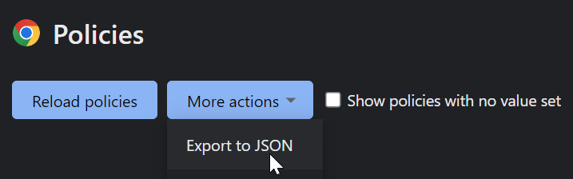
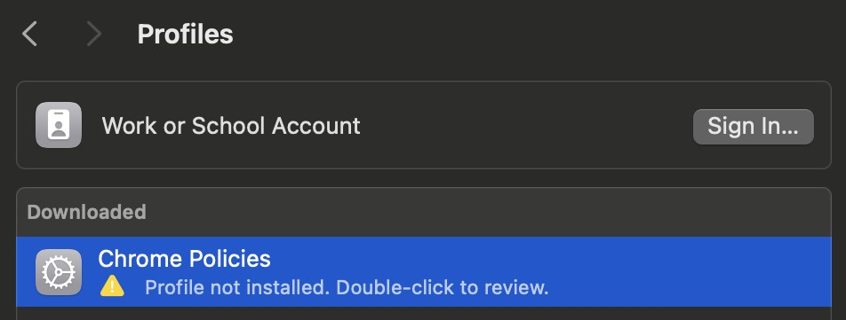

# Chrome Policy to Profile

Takes an exported Chrome `policies.json` file and converts it to an Apple Configuration Profile (`.mobileconfig`).

Supported Chromium-based browsers:
* Google Chrome
* Microsoft Edge

## Usage

```
usage: chrome-policy-to-profile.py [-h] input output

positional arguments:
  input       Input JSON file (e.g., policies.json)
  output      Output mobileconfig file (e.g., policies.mobileconfig)

options:
  -h, --help  show this help message and exit
```

## Example

If you already have policies set on Chrome and want to export them to a Apple Configuration Profile that can be imported on a Mac

1. Navigate to [chrome://policy](chrome://policy)
2. Click on "More actions" and select "Export to JSON"  
   
3. Assuming policies.json is in your Downloads folder on Windows, run the following command to convert it to a mobileconfig file. Replace `<USERNAME>` with your username.
   ```
   $ python3 chrome-policy-to-profile.py C:\Users\<USERNAME>\Downloads\policies.json policies.mobileconfig
   ```
4. Transfer the mobileconfig file to your Mac and double-click on the file to begin installing it.
5. Open System Settings and navigate to Privacy & Security -> Profiles. You should see the profile you just opened. Double-click on it to finish installing it.  
   
